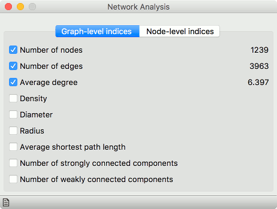
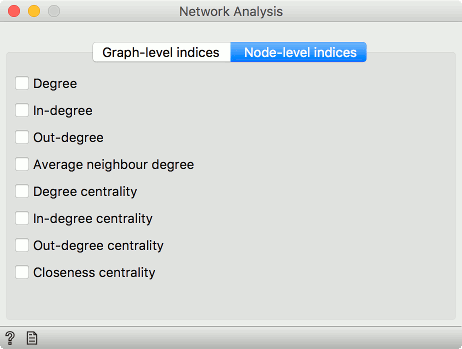

Network Analysis
================

Statistical analysis of network data.

**Inputs**

- Network: An instance of Network Graph.
- Items: Properties of a network file.

**Outputs**

- Network: An instance of Network Graph with appended information.
- Items: New properties of a network file.

**Network Analysis** widget computes node-level and graph-level summary statistics for the network. It outputs a network with the new computed statistics and an extended item data table (node-level indices only).

####Graph level

- Number of nodes: number of vertices in a network.
- Number of edges: number of connections in a network.
- Average degree: average number of connections per node.
- Density: ratio between actual number of edges and maximum number of edges (fully connected graph).
- [Diameter](http://networkx.github.io/documentation/networkx-1.7/reference/generated/networkx.algorithms.distance_measures.diameter.html#diameter): maximum eccentricity of the graph.
- Radius: minimum eccentricity of the graph.
- Average shortest path length: expected distance between two nodes in the graph.
- Number of strongly connected components: parts of network where every vertex is reachable from every other vertex (for directed graphs only).
- Number of weakly connected components: parts of network where replacing all of its directed edges with undirected edges produces a connected (undirected) graph (for directed graphs only).

####Node level

- Degree: number of edges per node.
- In-degree: number of incoming edges in a directed graph.
- Out-degree: number of outgoing edges in a directed graph.
- Average neighbor degree: average degree of neighboring nodes.
- Degree centrality: ratio of other nodes connected to the node.
- In-degree centrality: ratio of incoming edges to a node in a directed graph.
- Out-degree centrality: ratio of outgoing edges from a node in directed graph.
- Closeness centrality: distance to all other nodes.

Example
-------

This simple example shows how **Network Analysis** can enrich the workflow. We have used *lastfm.net* as our input network from [Network File](networkfile.md) and sent it to **Network Analysis**. We've decided to compute *degree*, *degree centrality* and *closeness centrality* at node level.

We can visualize the network in [Network Explorer](networkexplorer.md). In the widget we color by *best tag*, as is the default for this data set. But now we can also set the size of the nodes to correspond to the computed *Degree centrality*. This is a great way to visualize the properties of the network.

