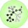
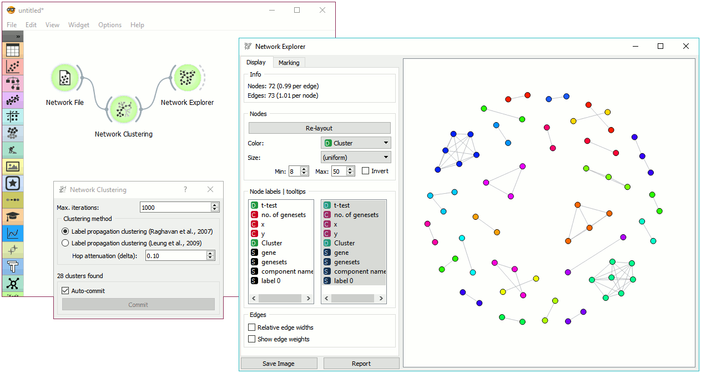

Network Clustering
==================

Detect clusters in a network.

Signals
-------

**Inputs**:

-  **Network**

   An instance of Network Graph.

**Outputs**:

-  **Network**

   An instance of Network Graph with clustering information appended.

Description
-----------

**Network Clustering** widget finds clusters in a network. Clustering works with two algorithms, one from Raghavan et al. (2007), which uses label propagation to find appropriate clusters, and one from Leung et al. (2009), which builds upon the work from Raghavan and adds hop attenuation as a parameters for cluster formation.

.. figure:: images/network-clustering-stamped.png

1. Clustering parameters:
   - Max. iterations: maximum number of iteration allowed for the algorithm to run (can converge before reaching the maximum).
   - Clustering method:

      - Label propagation clustering (Raghavan et al., 2007)
      - Label propagation clustering (Leung et al., 2009) with hop attenuation.

2. Information on the number of clusters found.
3. If *Auto-commit* is ticked, results will be automatically sent to the output. Alternatively, press *Commit*.

Example
-------

**Network Clustering** can help you uncover cliques and highly connected groups in a network. First, we will use :doc:`Network File <networkfile>` to load *leu_by_genesets.net* data set. Then we will pass the network through **Network Clustering**. The widget found 28 clusters in a network. To visualize the results, use :doc:`Network Explorer <networkexplorer>` and set *Color* attribute to *Cluster*. This will color network nodes with the corresponding cluster color - this is a great way to visualize highly connected groups in dense networks.

