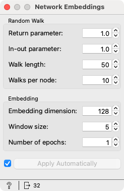
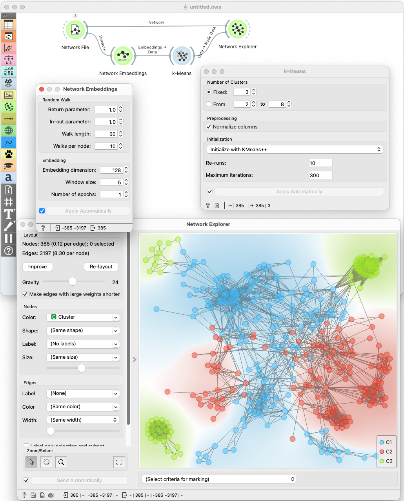

Network Embeddings
==================

Statistical analysis of network data.

**Inputs**

- Network: An instance of Network Graph.

**Outputs**

- Embeddings: A table with node embeddings

**Network Embeddings** computes node embeddings using Node2Vec.

**Random walk parameters**

- *Return parameter* sets the likelihood of returning to the previous node.
- *In-out parameter* sets the likelihood of exploring outward nodes.
- *Walk length* sets the length of each random walk.
- *Walks per node* sets the number of random walks to start at each node.

**Embedding parameters**

- *Embedding dimension* sets the number of dimensions for the embedding space.
- *Window size* sets the size of the context window for the Skip-gram model.
- *Number of epochs* sets the number of training iterations for the Skip-gram model.

Example
-------

We loaded the network data from the Dicty publication network from demonstration
networks and computed node embeddings. We used the k-means clustering to cluster
the node according to their embeddings.

We then plotted the network in [Network Explorer](networkexplorer.md), where
we colored the nodes according to their cluster assignment.

