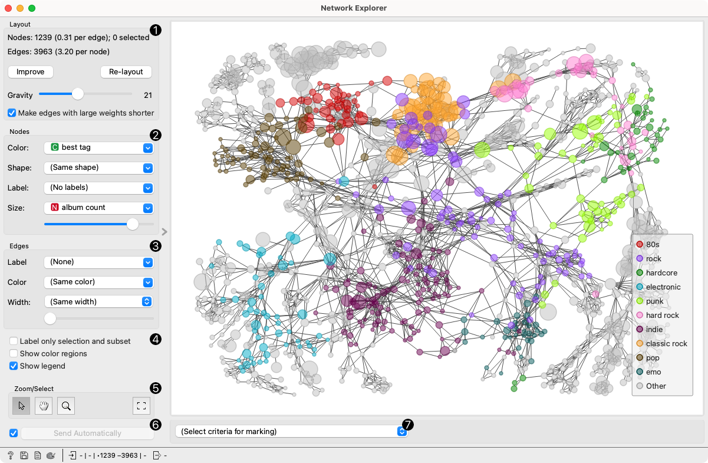
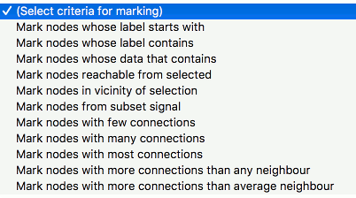
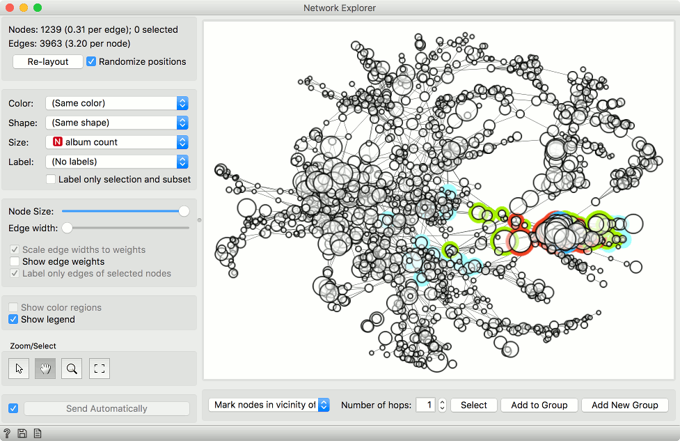
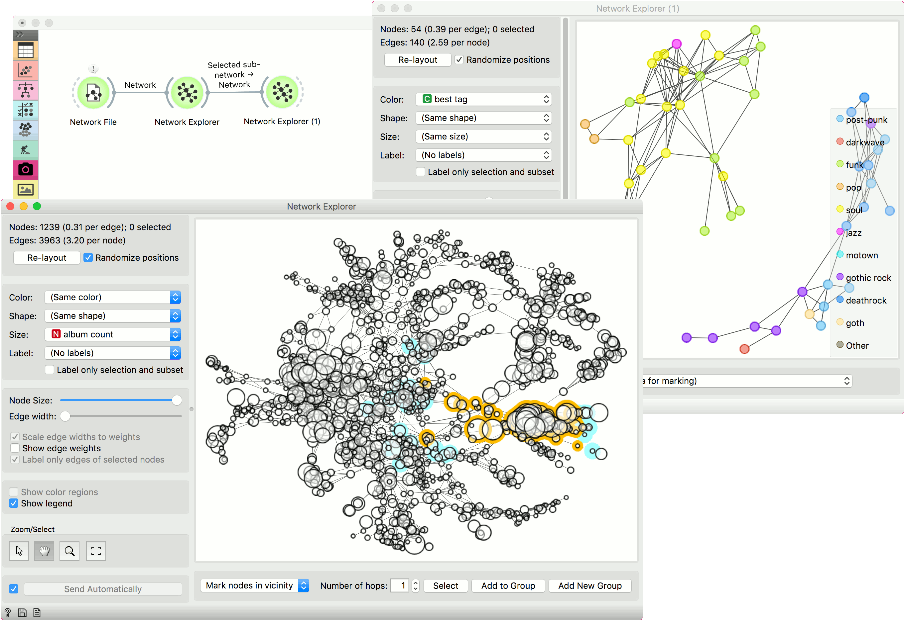

Network Explorer
================

Visually explore the network and its properties.

**Inputs**

- Network: An instance of Network Graph.
- Node Subset: A subset of vertices.
- Node Data: Information on vertices.
- Node Distances: Data on distances between nodes.

**Outputs**

- Selected sub-network: A network of selected nodes.
- Distance Matrix: Distance matrix.
- Selected Items: Information on selected vertices.
- Highlighted Items: Information on highlighted vertices.
- Remaining Items: Information on remaining items (not selected or highlighted).

**Network Explorer** is the primary widget for visualizing network graphs. It displays a graph with [Fruchterman-Reingold layout optimization](https://en.wikipedia.org/wiki/Force-directed_graph_drawing) and enables setting the color, size and label of nodes. One can also highlight nodes of specific properties and output them.

The visualization in **Network Explorer** works just like the one for **Scatter Plot**. To select a subset of nodes, draw a rectangle around the subset. Shift will add a new group. Ctrl-Shift (Cmd-Shift) will add to the existing group. Alt (Option) will remove from the group. Pressing outside of the network will remove the selection.

1. Information on the network. Reports on the number (and proportion) of nodes and edges. Press 'Re-layout' to re-compute nodes with Fruchterman-Reingold optimization. Select 'Randomize positions' starts from random position of nodes.
2. Set the color, shape, size and label of the nodes by attribute. Color will display the 10 most frequent values and color the rest as 'Other'. Shape is assigned to the 5 most frequent values and the rest is marked as 'Other'. *Label only selection and subset* is handy for keeping the projection organized.
3. Set the (relative) node size and edge width. By default, edge widths correspond to their weights. To see the weight value, select *Show edge weights*. By default, only the edges of selected nodes are labeled to keep the projection organized.
4. *Show color regions* colors the projection according to the majority node value. Deselect *Show legend* to hide the legend.
5. Select, zoom, pan and zoom to fit are the options for exploring the graph. The manual selection of data instances works as an angular/square selection tool. Double click to move the projection. Scroll in or out for zoom.

####Marking

Pressing *Select* will select and output the highlighted nodes. *Add to Group* adds to the existing selection, while *Add New Group* creates a new group.

The widget enables selection of nodes by the specified criterium:

- *Mark nodes whose label starts with*. Set the condition to highlight the nodes whose label starts with the specified text. Label must be set for the highlighting to work. Press *Select* to select the highlighted nodes.
- *Mark nodes whose label contains*. Set the condition to highlight the nodes whose label contains the specified text. Label must be set for the highlighting to work. Press *Select* to select the highlighted nodes.
- *Mark nodes whose data contains*. Set the condition to highlight the nodes whose attributes contain the specified text. Press *Select* to select the highlighted nodes.
- *Mark nodes reachable from selected*. Highlight the nodes that can be reached from the selected nodes. At least one node has to be selected for the highlighting to work.
- *Mark nodes in vicinity of selection*. Highlight the nodes that are a selected number of hops away (first degree neighbors, second degree neighbors, etc.).
- *Mark nodes from subset signal*. Highlight the nodes that are neighbors of the nodes from the *Node Subset* input.
- *Mark nodes with few connections*. Highlight the nodes that have equal or less connections than the set number.
- *Mark nodes with many connections*. Highlight the nodes that have equal or more connections than the set number.
- *Mark nodes with most connections*. Highlight the nodes that have the most connections. The number of marked specifies how many top connected nodes to highlight (list is ranked).
- *Mark nodes with more connections than any neighbor*. Highlight the most connected nodes.
- *Mark nodes with more connections than average neighbor*. Highlight nodes whose degree is above average.

####Selecting a subset

Just like **Scatter Plot** widget, the **Network Explorer** supports group selection. To create the first group, either select nodes from the plot or highlight them by setting the criterium and pressing *Select*.

In the example below, we selected a single node (blue). Then we used *Mark nodes in vicinity of selection* to highlight neighbors of the selected node. We used *Add New Group* to create a new (red) group. Pressing *Add New Group* again will create yet another (green) group.

*Add to Group* would add the highlighted (light blue) nodes to the last (green) group. This make this widget a nice tool for visualizing hops and network propagation.

Example
-------

In this example we will use the *lastfm* data set that can be loaded in the **Network File** widget under *Browse documentation networks*. The nodes of the network are musicians, which are characterized by the genre they play, number of albums produced and so on. The edges are the number of listeners on LastFm.

The entire data set is visualized in **Network Explorer**. In the widget, we removed the coloring and set the size of the nodes to correspond to the *album count*. Then we selected some nodes from the network. We can observe the selection in **Network Explorer (1)**.

