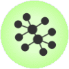
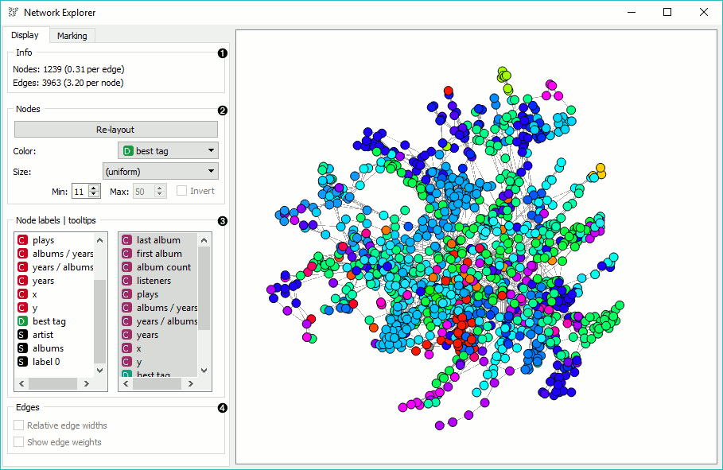
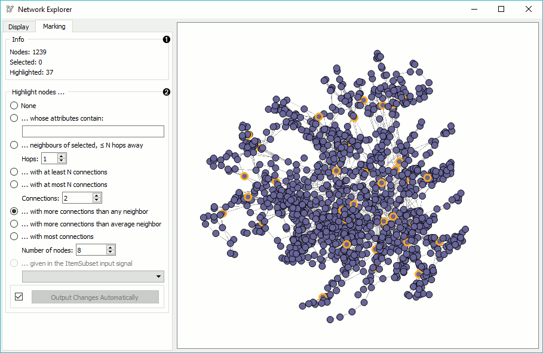
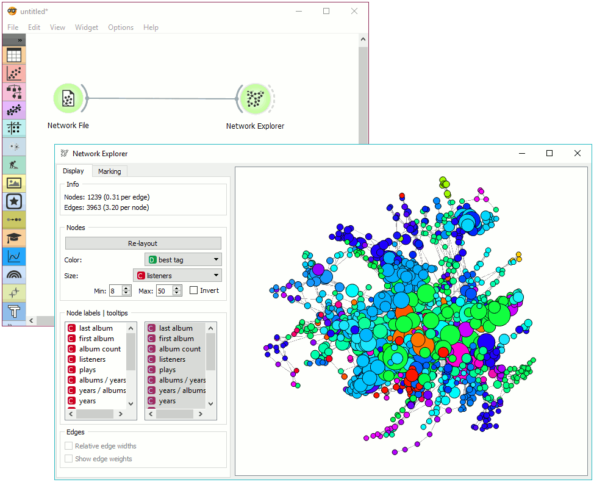
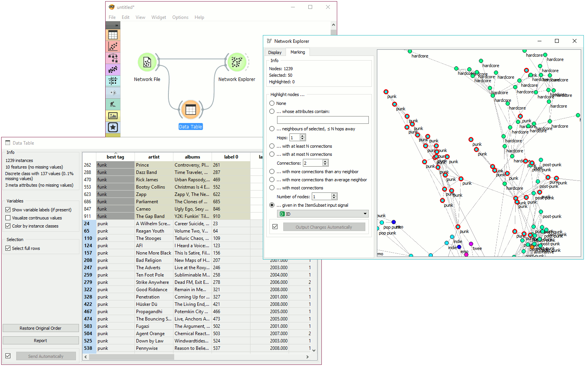

Network Explorer
================

Visually explore the network and its properties.

Signals
-------

**Inputs**:

-  **Network**

   An instance of Network Graph.

-  **Node Subset**

   A subset of vertices.

-  **Node Data**

   Information on vertices.

-  **Node Distances**

   Data on distances between nodes.

**Outputs**:

-  **Selected sub-network**

   A network of selected nodes.

-  **Distance Matrix**

   Distance matrix.

-  **Selected Items**

   Information on selected vertices.

-  **Highlighted Items**

   Information on highlighted vertices.

-  **Remaining Items**

   Information on remaining items (not selected or highlighted).

Description
-----------

**Network Explorer** is the primary widget for visualizing network graphs. It displays a graph with `Fruchterman-Reingold layout optimization <https://en.wikipedia.org/wiki/Force-directed_graph_drawing>`_ and enables setting the color, size and label of nodes. One can also highlight nodes of specific properties and output them.

Nodes can be moved around freely as their position in space is not fixed (only optimized). To select a subset of nodes, draw a rectangle around the subset. To highlight the nodes, set the criterium in *Marking* tab and press Enter to turn highlighted nodes (orange) into selected nodes (red). To use pan and move the network around, use the right click. Scroll in for zoom.

Display
~~~~~~~

1. Information on the network. Reports on the number (and proportion) of nodes and edges.
2. Nodes: re-layout nodes with Fruchterman-Reingold optimization. Color and set the size of nodes by attribute. Set the maximum and minimum size of nodes and/or invert their sizing.
3. Node labels | tooltips: set node labels from the menu on the left and node tooltips from the menu on the right.
4. Edges:
   - If *Relative edge widths* is ticked, edges will have a thickness proportionate to their weight. Weights must be provided on the input for the option to be available.
   - If *Show edge weights* is ticked, weight will be displayed above the edges.

Marking
~~~~~~~

1. Information on the output. Reports on the number of nodes in the graph, selected nodes (red color), and highlighted nodes (orange color).
2. Highlight nodes:
   - None. Nodes are highlighted.
   - ...whose attributes contain. Nodes that satisfy a stated condition will be highlighted.
   - ...neighbors of selected, ≤ N hops away. Highlights nodes of selected points extending a specified number of hops away.
   - ...with at least N connections. With equal or more connections than specified in 'Connections'.
   - ...with at most N connections. With less or equal connections than specified in 'Connections'.
   - ...with more connections than any neighbor. Highlights well connected nodes (hubs).
   - ...with more connections than average neighbor. Highlights relatively well connected nodes.
   - ...with most connections. Highligts a specified number of well connected nodes.
   - ...given in the ItemSubset input signal. Highlights nodes matching the provided subset criteria (ID or other attribute).
   If 'Output Changes Automatically' is ticked, changes will be communicated automatically. Alternatively, press 'Output Changes'.

Examples
--------

In the first example we will simply display a network. We loaded *lastfm.net* data in :doc:`Network File <networkfile>` and send the data to **Network Explorer**. The widget shows an optimized projection of artist similarity data. We colored the nodes by 'best tag' attribute, showing different genres artists belong to, and set the size to the number of listeners per artist.

The second example shows how to highlight a specific subset in the graph. We continue to use *lastfm.net* data from the :doc:`Network File <networkfile>`. We also retained connection to the **Network Explorer**. 

Then we created a second link to **Data Table** widget, where we selected all the artists from the punk genre. We sent these data to **Network Explorer** where we set *Highlight nodes* to *...given in the ItemSubset input signal*. Attribute ID was automatically considered for matching nodes. We can see nodes we selected in the subset highlighted in the graph. To mark them as a selected subset, press Enter.
