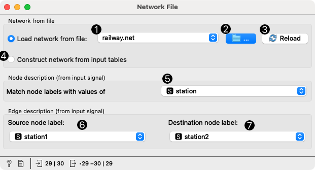

Network File
============

Read network graph file in Pajek format.

**Outputs**

- Network: An instance of Network Graph.
- Items: Properties of a network file.

**Network File** widget reads network files and sends the input data to its output channel. History of the most recently opened files in maintained in the widget. The widget also includes a directory with sample data sets that come pre-installed with the add-on.

The widget reads data in .net and .pajek formats. A complimentary .tab, .tsv or .csv data set can be provided for node information. Orange by default matches a file with the same name as .net file.

1. Load network file. The widget construct a data table from the data whose filename matches the graph filename (i.e. *lastfm.net* and *lastfm.tab*) or, if no match is found, from the graph. A dropdown menu provides access to documentation data sets with *Browse documentation networks...*.
2. The folder icon provides access to local data files.
3. Reload the data file from 1.
4. Status bar reports on the number of nodes and edges and the type of the graph.
5. Information, warnings and errors. Hover over a message to read it all.

Example
-------

We loaded the *lastfm.net* from documentation data set (dropdown → Browse documentation networks). The nicest way to observe network data is with the [Network Explorer](networkexplorer.md) widget. **Network File** widget automatically matched the corresponding data file (*lastfm.net* with *lastfm.tab*), so node attributes are available in the widget.

