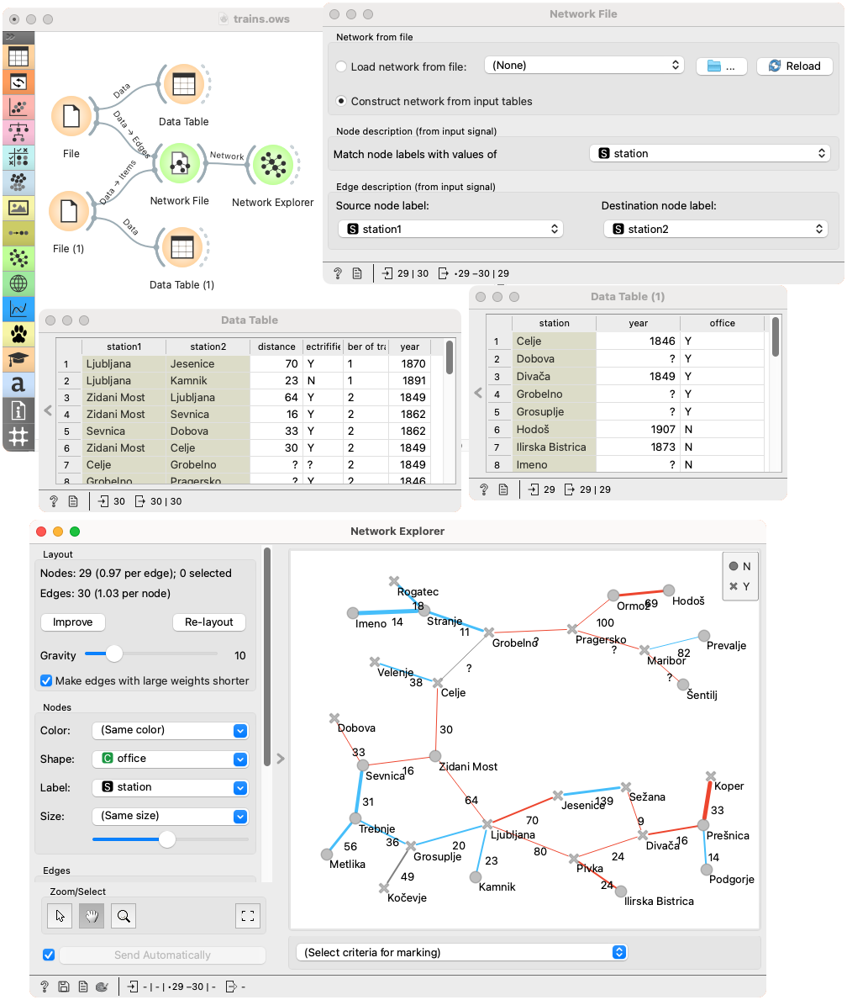

Network File
============

Read network graph file in a Pajek-like format. The widget can also construct a network from input tables if no file is provided.

**Inputs**

- Items: An optional table with properties of network nodes.
- Edges: An optional table with properties of network edges.
- 
**Outputs**

- Network: An instance of Network Graph.
- Items: Properties of a network file.

**Network File** widget reads network files and sends the input data to its output channel. A complimentary .tab, .tsv or .csv data set can be provided for node information. Orange by default matches a file with the same name as .net file.

Additional node and edge annotation can be provided in input tables.

1. Shows the current file and allows choosing a recent network file or browsing documentation networks.
2. Browse for a local network file.
3. Reload the network from a file.
4. Construct a network from input tables instead of a file.
5. When an input table with additional nodes data is present, this combo is used to set the column that is matched to node labels from the file (or the edge table on the input, if no file is used).
5. Sets the columns from the input edge table that correspond to source and target node labels, either to match nodes from the file or to construct a network from the edge table.

The widget loads the data from an extended Pajek format. The format is not documented well and is being changed over time. The original format seems to allow adding weights (a number) as the third item in the edge definition line. Orange will allow non-numeric values and treat them as edge labels.

A more powerful way to add data to nodes and labels is to provide input tables.

A table with additional node annotations may be passed to the Node input. The table rows are matched with network nodes either sequentially (the first row to the first node, the second to the second, etc.) or by matching a selected column in the table to node labels from the file. The widget offers columns without duplicate values; all node labels in the network file must be present in the column. Additional columns in the node table are added as node attributes.

The Edge input provides a similar annotations for edges. The table must contain two columns that identify source and target nodes. These may be text columns that are matched to node labels from the file or numeric columns with node indices (1-based). Additional columns in the edge table are added as edge attributes.

If no table with node annotations is provided, the widget looks for a file whose name matches the graph filename (i.e. *lastfm.net* and *lastfm.tab*), and uses it if found.

The widget can also construct a network from input tables if no file is provided. In this case, the Edge input must be connected. The Node input is optional.

-------

We loaded the *lastfm.net* from documentation data set (dropdown → Browse documentation networks). The nicest way to observe network data is with the [Network Explorer](networkexplorer.md) widget. **Network File** widget automatically matched the corresponding data file (*lastfm.net* with *lastfm.tab*), so node attributes are available in the widget.

In the following example, we construct a network from a table of edges rather than reading it from the file. The table contains junctions and terminal stations in the Slovenian railway network. We use column *station1* and *station2* to define edges: the values in the two columns correspond to node labels, and two labels are connected if they appear in the same row. Other columns (such as distance, year, electricified) in that table are used as additional edge annotations that we can use to, for instaance, label or color edges in the **Network Explorer**.

We also provided a table with node annotations, which contain some information on stations (year opened, station office), which we can use for color, size, shape and label in the **Network Explorer**.

This same workflow could also load the network from the file. In this case, the input tables data would have to match network data; warnings are shown if the table with edges has missing edges or contains edges not present in the file.

Note: the data is not updated and may be incorrect. The layout of the visualized network does not match the physical layout of the railway network.