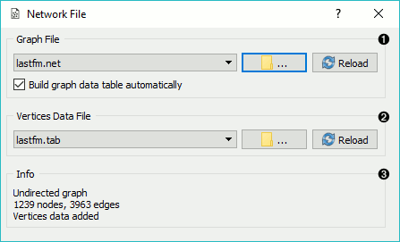
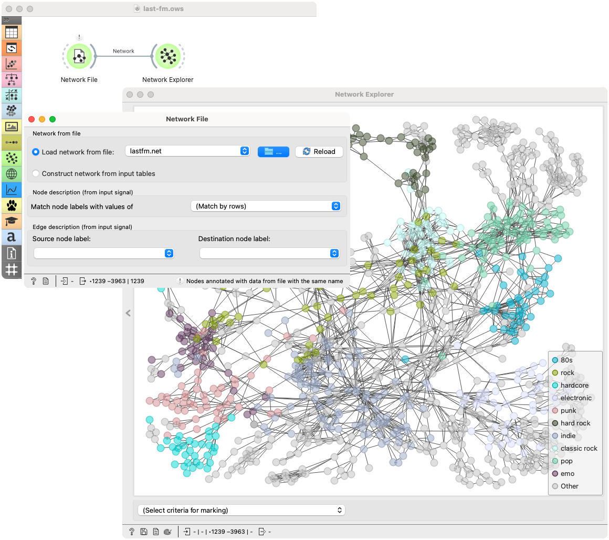
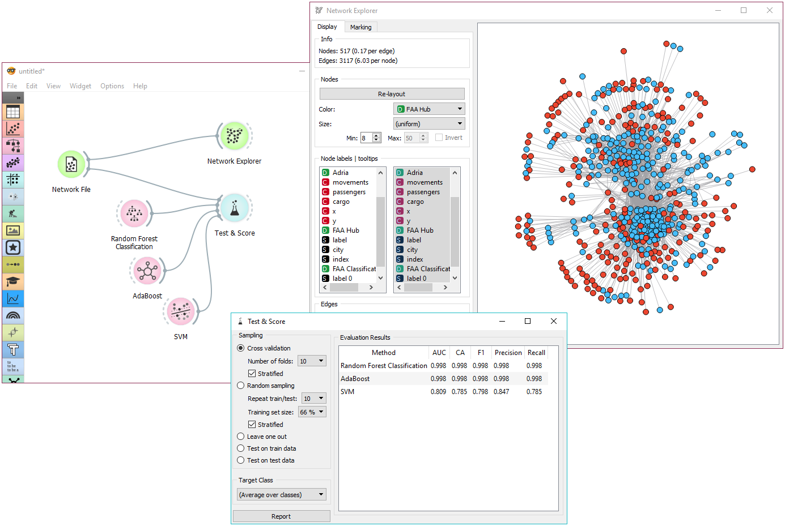

Network File
============

.. figure:: icons/network-file.png

Read network graph file in Pajek or GML format.

Signals
-------

**Inputs**:

-  (None)

**Outputs**:

-  **Network**

   An instance of Network Graph.

-  **Items**

   Properties of a network file.

Description
-----------

**Network File** widget reads network files and sends the input data to its output channel. History of the most recently opened files in maintained in the widget. The widget also includes a directory with sample data sets that come pre-installed with the add-on.

The widget reads data in .net, .gml, .gpickle, .gz, and .edgelist formats. A complimentary .tab or .csv data set can be provided for node information. Orange by default matches a file with the same name as .net file. If (None) is selected, the widget will generate the data from the graph.

1. Graph File. Loads network file and (optionally) constructs a data table from the graph. A dropdown menu provides access to documentation data sets with *Browse documentation networks...*. The folder icon provides access to local data files. If *Build graph data table automatically* is checked, the widget will not output an inferred data table (no *Items* output will be available). 
2. Vertices Data File. Information on the network nodes. Reads standard Orange data files. he folder icon provides access to local data files.
3. Information on the constructed network. Reports on the type of graph, number of nodes and edges and the provided vertices data file.

Examples
--------

We loaded *lastfm.net* from documentation data set (dropdown → Browse documentation networks) and connected **Data Table** and :doc:`Network Explorer <networkexplorer>` to the widget. **Network File** widget automatically matched the corresponding vertices data file. It outputs *Network* to **Network Explorer** where we can visualize the constructed network and *Items* to **Data Table**, where we can check the attributes of vertices.

The second example shows how to use the Network add-on for predictive modelling. We used *airtraffic.net* data and visualized the network in :doc:`Network Explorer <networkexplorer>`. We colored the nodes by FAA Hub attribute (is the airport a hub or not).

Then we tried to predict this value using **Test&Score** and a few classifiers (Random Forest, AdaBoost, SVM) from the core Orange. We can also connect the output of **Test&Score** to **Network Explorer** using the Predictions → Node Data link and then coloring the nodes by predictions in the visualization.
