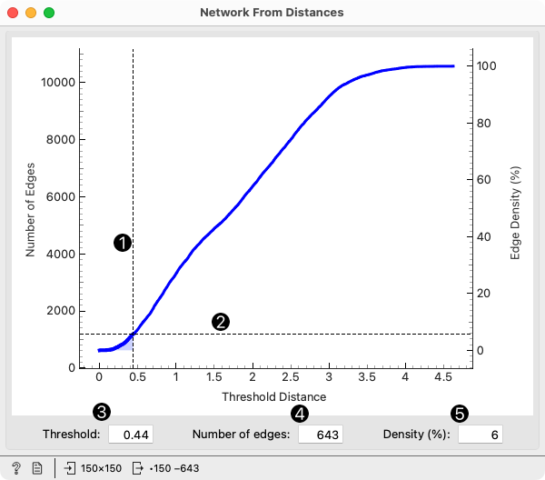
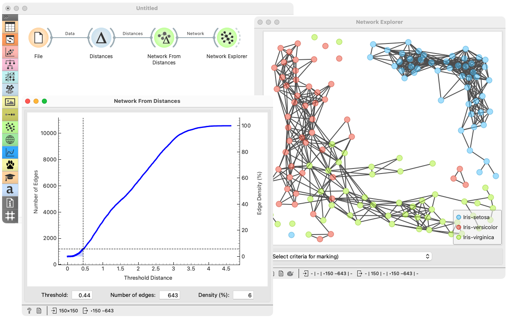

Network From Distances
======================

Constructs a network from distances between instances.

**Inputs**

- Distances: A distance matrix.

**Outputs**

- Network: An instance of Network Graph.

**Network from Distances** constructs a network graph from a given distance matrix. The network is constructed by connecting the closest data instances, where the number of connections is set directly, or by threshold distance or by graph density.

The widget presents an interactive graph that shows the relation between the threshold distance and the number of connections (left axis) and graph density (right axis). The density is the proportion of edges in the graph relative to the number of possible edges.

1. Drag the horizontal line to set the threshold distance.
2. Drag the vertical line to set the number of connections or graph density.
3. Threshold distance: the distance can be set manually, and it also changes when any of the lines or other parameters is edited.
4. Number of connections: set manually or indirectly, by changing the threshold distance or graph density.
5. Graph density, that is, the proportion of edges in the graph relative to the number of possible edges, set manually or indirectly.

All five modes of setting the graph are interconnected, so changing one will change the others and move the lines accordingly.

Example
-------

**Network from Distances** creates networks from distance matrices. It can transform data sets from a data table via distance matrix into a network graph. This widget is great for visualizing instance similarity as a graph of connected instances.

We took *iris.tab* to visualize instance similarity in a graph. We sent the output of **File** widget to **Distances**, where we computed Euclidean distances between rows (instances). Then we sent the output of **Distances** to **Network from Distances**, where we dragged the horizontal line low enough to get a reasonably dense network, as observed in the [Network Explorer](networkexplorer.md).
