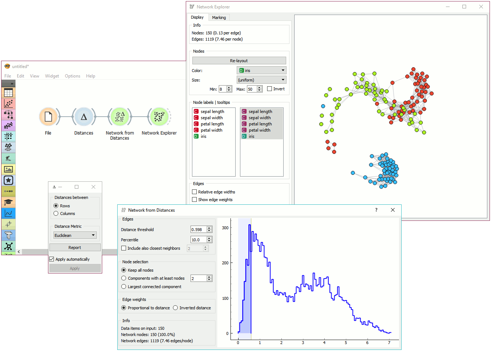

Network From Distances
======================

Constructs a network from distances between instances.

Signals
-------

**Inputs**:

-  **Distances**

   A distance matrix.

**Outputs**:

-  **Network**

   An instance of Network Graph.

-  **Data**

   Attribute-valued data set.

-  **Distances**

   A distance matrix.

Description
-----------

**Network from Distances** constructs a network graph from a given distance matrix. Graph is constructed by connecting nodes from data table where the distance between nodes is between the given threshold. In other words, all instances with a distance lower than the selected threshold, will be connected.

.. figure:: images/network-from-distances-stamped.png

1. Edges:
   - Distance threshold: a closeness threshold for the formation of edges.
   - Percentile: the percentile of data instances to be connected.
   - *Include also closest neighbors*: includes a number of closest neighbor to the selected instances.
2. Node selection:
   - Keep all nodes: entire network is on the ouput.
   - Components with at least X nodes: filters out nodes with less than the set number of nodes.
   - Largest connected component: keep only the largest cluster.
3. Edge weights:
   - Proportional to distance: weights are set to reflect the distance (closeness).
   - Inverted distance: weights are set to reflect the inverted distance.
4. Information on the constructed network:
   - Data items on input: number of instances on the input.
   - Network nodes: number of nodes in the network (and the percentage of the original data).
   - Network edges: number of constructed edges/connections (and the average number of connections per node).
5. Distance graph. Manually select the distance threshold from the graph by dragging the vertical line left or right.

Example
-------

**Network from Distances** creates networks from distance matrices. It can transform continuous-valued data sets from a data table via distance matrix into a network graph. This widget is great for visualizing instance similarity as a graph of connected instances.

We took *iris.tab* to visualize instance similarity in a graph. We sent the output of **File** widget to **Distances**, where we computed Euclidean distances between rows (instances). Then we sent the output of **Distances** to **Network from Distances**, where we set the distance threshold (how similar the instances have to be to draw an edge between them) to 0.598. We kept all nodes and set edge weights to *proportional to distance*.

Then we observed the constructed network in a :doc:`Network Explorer <networkexplorer>`. We colored the nodes by *iris* attribute.
