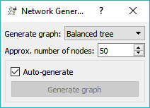
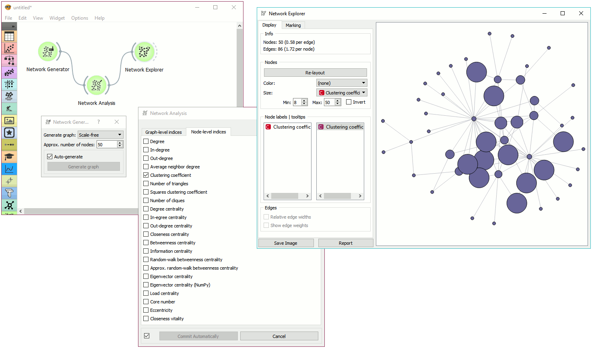

Network Generator
=================

Construct example graphs.

**Outputs**

- Generated Network: An instance of Network Graph.

**Network Generator** constructs exemplary networks. It is mostly intended for teaching/learning about networks.

Graph options:

- [Path](https://en.wikipedia.org/wiki/Path_(graph_theory)): a graph that can be drawn so that all of its vertices and edges lie on a single straight line.
- [Cycle](https://en.wikipedia.org/wiki/Cycle_(graph_theory)): a graph that consists of a single cycle, i.e. some number of vertices (at least 3) are connected in a closed chain.
- [Complete](https://en.wikipedia.org/wiki/Complete_graph): simple undirected graph in which every pair of distinct vertices is connected by a unique edge.
- [Complete bipartite](https://en.wikipedia.org/wiki/Bipartite_graph): a graph whose vertices can be divided into two disjoint and independent sets.
- [Barbell](https://en.wikipedia.org/wiki/Barbell_graph): two complete graphs connected by a path.
- [Ladder](https://en.wikipedia.org/wiki/Ladder_graph): planar undirected graph with 2n vertices and 3n-2 edges.
- [Circular ladder](http://mathworld.wolfram.com/CircularLadderGraph.html): Cartesian product of two path graphs.
- [Grid](http://mathworld.wolfram.com/GridGraph.html): a graph whose drawing, embedded in some Euclidean space, forms a regular tiling.
- [Hypercube](https://en.wikipedia.org/wiki/Hypercube_graph): a graph formed from the vertices and edges of an n-dimensional hypercube.
- [Star](https://en.wikipedia.org/wiki/Star_(graph_theory)): Return the Star graph with n+1 nodes: one center node, connected to n outer nodes.
- [Lollipop](https://en.wikipedia.org/wiki/Lollipop_graph): a complete graph (clique) and a path graph, connected with a bridge.
- [Geometric](https://en.wikipedia.org/wiki/Random_geometric_graph): an undirected graph constructed by randomly placing N nodes in some metric space.

Press *Regenerate Network* to output a new graph instance.

Example
-------

**Network Generator** is a nice tool to explore typical graph structures.

Here, we generated a *Grid* graph of height 4 and width 5 and sent it to [Network Analysis](networkanalysis.md). We computed node degrees and sent the data to [Network Explorer](networkexplorer.md). Finally, we observed the generated graph in the visualization and set the size and color of the nodes to *Degree*. This is a nice tool to observe and explain the properties of networks.
