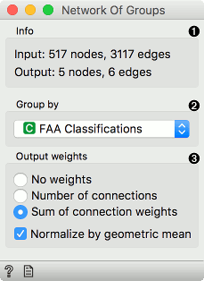
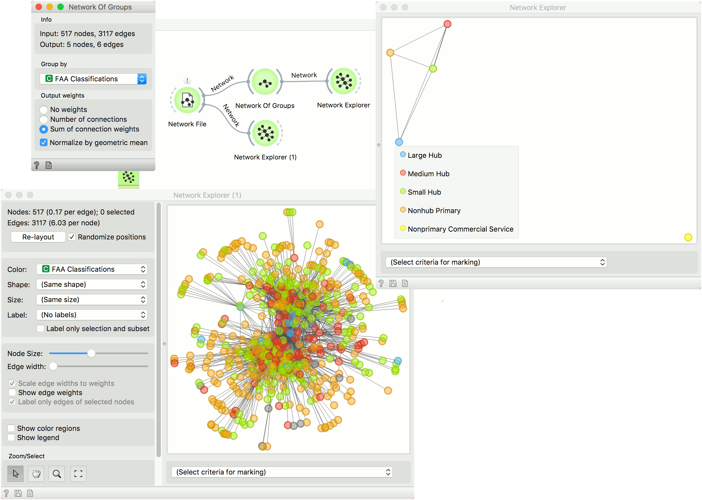

Network Of Groups
=================

Group instances by feature and connect related groups.

**Inputs**

- Network: An instance of network graph.
- Data: Properties of a network graph.

**Outputs**:

- Network: A grouped network graph.
- Data: Properties of the group network graph.

**Network of Groups** is the network version of the group-by operation. Nodes with the same values of the attribute, selected in the dropdown, will be represented as a single node.

1. Information on the input and output network.
2. Select the attribute to group by.
3. Compute weights:
   - *No weights*: all weights are set to 1.
   - *Number of connections*: weight edges by the number of connections between the groups.
   - *Sum of connection weights*:  weight edges by the sum of weights of connections between the groups.
   *Normalize by geometric mean* divides weights by the geometric mean of the number of connections between the two groups.

Example
-------

In this example we are using *airtraffic* data set, that we loaded in the [Network File](networkfile.md) widget. We see the entire data set in **Network Explorer (1)**.

Then we use **Network of Groups** to group the network by the *FAA Classifications* attribute. All nodes with the same value of this attribute will be represented as a single node in the output. There is an edge between the two nodes, if they share connections in the original network.

The grouped network is shown in [Network Explorer](networkexplorer.md).

