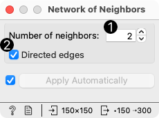
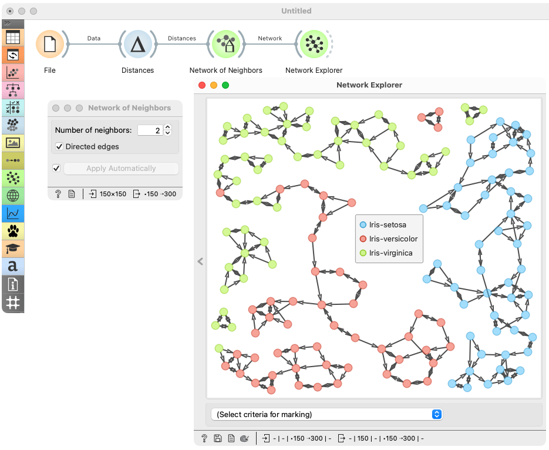

Network of Neighbors
====================

Constructs a network by connecting neighbouring instances based on distances.

**Inputs**

- Distances: A distance matrix.

**Outputs**

- Network: An instance of Network Graph.

**Network of Neighbors** constructs a network graph from a given distance matrix by connecting each instance to its nearest neighbors.

1. Set the number of nearest neighbors to connect each instance to.
2. If checked, edges are directed.

Example
-------

We took *iris.tab* to visualize instance similarity in a graph. We sent the output of **File** widget to **Distances**, where we computed Euclidean distances between rows (instances). Then we sent the output of **Distances** to **Network of neighbours** to connect each instance to its two nearest neighbors. The resulting network is shown in the [Network Explorer](networkexplorer.md).

