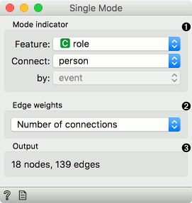
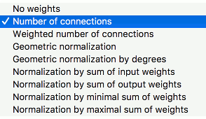

Single Mode
===========

Convert multimodal graphs to single modal.

**Inputs**

- Network: An instance of a bipartite network graph.

**Outputs**

- Network: An instance of single network graph.

**Single Mode** works with bipartite networks, where subsets are marked with a binary discrete attribute. The widget outputs a network where nodes represent the selected value (e.g. persons) and edges the remaining value (e.g. event). The widget also works with non-binary discrete attributes, but will treat them as binary (one-versus-all).

1. Mode indicator:
   - *Feature*: discrete feature labeling network subsets.
   - *Connect*: value used as nodes.
   - *by*: value used as edges.
2. Edge weights: compute weights for the output network.
3. Information on the output network.

####Edge weights

- *No weights*: all weights are set to 1.
- *Number of connections*: weights correspond to the number of common connections (e.g. events the two people participated in).
- *Weighted number of connections*: weights correspond to the sum of  the product of original edge weights that connect each person with the event.

For details and for description of other options, see Vlado Batagelj's [Introduction to Network Science using Pajek](http://vladowiki.fmf.uni-lj.si/lib/exe/fetch.php?media=pajek:ev:pdf:na07.pdf), section 7, page 38.

Example
-------

For this example we have used the famous *davis* data set that describes ladies from the south of the United States and the events they have participated in. The network thus consists of nodes that are either persons or events. Node role is described in the attribute *role*. We load the network with [Network File](networkfile.md).

We see the original file in [Network Explorer](networkexplorer.md). The blue nodes are events and the red ones are persons. Events are attended by persons. A node connects a person with the event, if the person attended the event. Now we can observe which people attended the same event or, conversely, which events were attended by the same people.

In **Single Mode** we set the feature describing the role of the nodes. It so happens that our attribute is named *role*. We connect persons (nodes) with the events they attended (edges). Edge weight will be the number of connections in common. In translation, edge weights will be the number of events both people attended.

**Network Explorer (1)** shows the final network.

